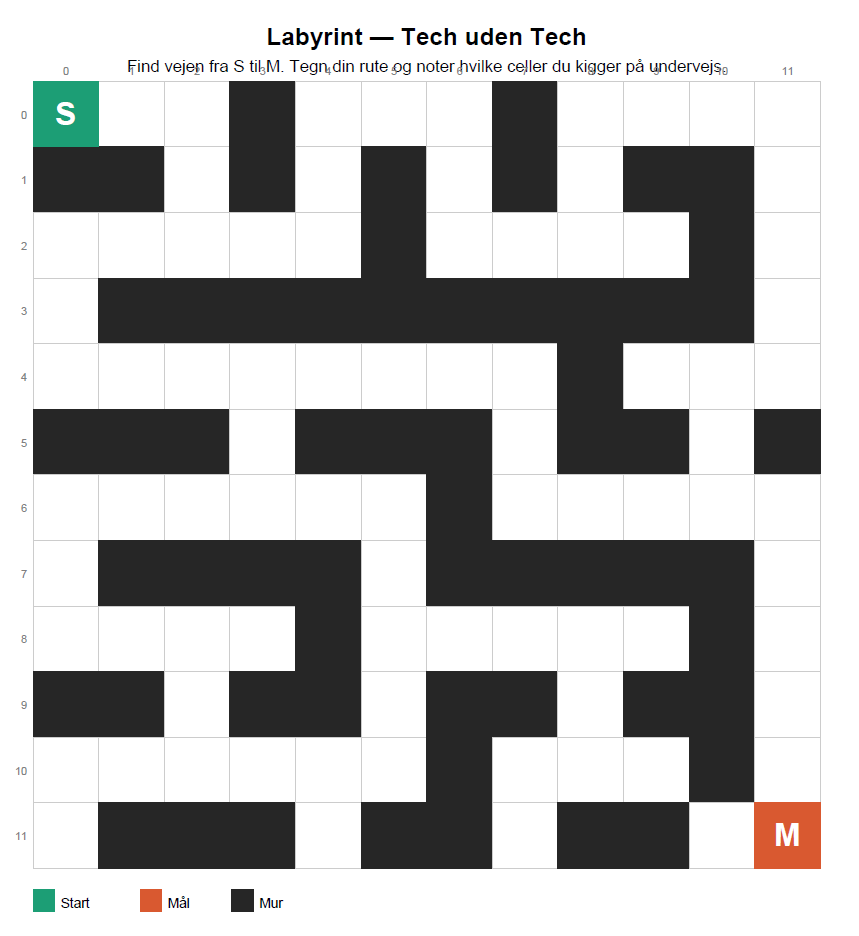

## Labyrint

Kig på labyrinten og find vejen fra S til M.

Noter undervejs:

Hvilke celler kigger du på?
Hvilke celler vælger du at gå til?
Hvilken strategi bruger du — går du bare frem, eller tænker du dig om?

Hvad ville Djikstra gøre? Hvert skridt fra ét felt til et andet koster 1 og murene er ikke en del af 
grafen idet vi ikke kan gå på dem. 




## Noter

**Vejen fra S til M**
- Jeg starter i celle (0,0) hvor S er.

**Rute gennem labyrinten**

Jeg bevæger mig sådan:

````java
(0,0)
→ (0,1)
→ (0,2)
↓
(1,2)
↓
(2,2)
← (2,1)
← (2,0)
↓
(3,0)
↓
(4,0)
→ (4,1)
→ (4,2)
→ (4,3)
→ (4,4)
→ (4,5)
→ (4,6)
→ (4,7)
↓
(5,7)
↓
(6,7)
→ (6,8)
→ (6,9)
→ (6,10)
→ (6,11)
↓
(7,11)
↓
(8,11)
↓
(9,11)
↓
(10,11)
↓
(11,11) = M
````

### Hvilke celler kigger jeg på?
Undervejs kigger jeg på nabo-cellerne:
- op
- ned
- højre
- venstre

**Jeg undersøger om:**
- cellen er indenfor banen
- cellen ikke er en mur
- jeg ikke allerede har besøgt den

### Hvilken strategi bruger jeg?
Jeg prøver ikke bare tilfældige veje.
Jeg undersøger systematisk hvilke felter der kan nås,
og vælger de felter der bringer mig tættere på målet uden at ramme mure.


### Hvad ville Dijkstra gøre?
**Dijkstra ville:**
- Starte ved S
- Give start-feltet afstanden 0
- Undersøge alle nabo-felter
- Hvert skridt koster 1
- Gemme den korteste afstand til hvert felt
- Fortsætte indtil M findes

Fordi alle skridt koster det samme (=1), vil Dijkstra finde den korteste vej gennem labyrinten.

### Hvorfor er det en graf?

**Labyrinten kan ses som en graf:**
- Hver fri celle = en node
- Man kan gå mellem nabo-celler = kanter
- Mure er ikke med i grafen

Så Dijkstra arbejder faktisk bare på en graf lavet af de åbne felter.


Den korteste vej består af 26 skridt fra S til M.